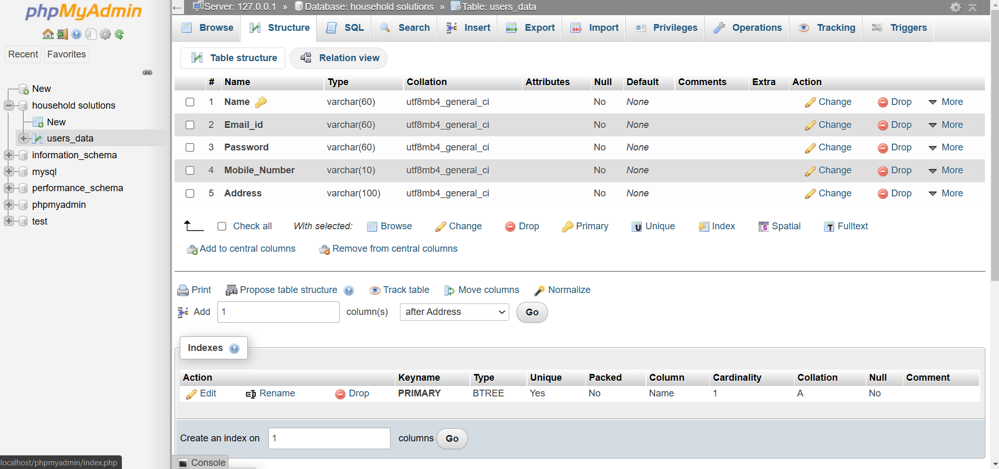

# AJ_Add_Agency
 <h1 align="center">Hi there 👋 , I’m Ajay Nandam</h1>
 

  • <a href="https://www.linkedin.com/in/ajay-nandam-03519320b/

">LinkedIN</a> 

&nbsp;

# AJ-Add-Agency

AJ Add Agency web using MYSQL,PHP and Bootstrap

> If any individual wants to publish your adds in our website.
> AJ-Adding-Agency provides a platform for all kind of Add services which requires less time in finding the service at any time & place.

&nbsp;

## Prerequisites
 - Install XAMPP web server
- Any Editor (Preferably VS Code or Sublime Text)
- Any web browser with latest version

## Technologies
- VS Code
- User Interface Design: HTML, CSS, Bootstrap, JAVASCRIPT
- Language Used: PHP 5.62 
- Database: My SQL
- Software: XAAMP Server

## Getting Started

1. Download and install XAMPP in your machine.
2. Clone or download the repository.
3. Extract all the files and move it to the 'htdocs' folder of your XAMPP directory.
4. Start the Apache and Mysql in your XAMPP control panel.
5. Open your web browser and type 'localhost/phpmyadmin'
6. In phpmyadmin page, create a new database from the left panel and name it as 'household solutions'.
7. Open a new tab and type 'localhost/foldername/login.html' in the url of your browser.

• NOTE: The data used in the project is test data so the sql file is not included in the repository.

&nbsp;

## Getting into the project
 ### Here are the screenshots of the project
 
 ## • Database Structure
 
 
 
 ## • User
 
 
 
 
 
 
 
 
 ## • Admin
 
 
 
 
 
 
 
&nbsp;

## 👨‍🚀 Show your support
 Give a ⭐️ if this project helped you! 
 If you have any issues or faces any bugs while running feel free to tag me in issues or email me sushanthrao2001@gmail.com!

----
Created by <a href="https://github.com/Ajay-Nandam

">Ajay N.</a>

Last edited on: 11-12-2021
